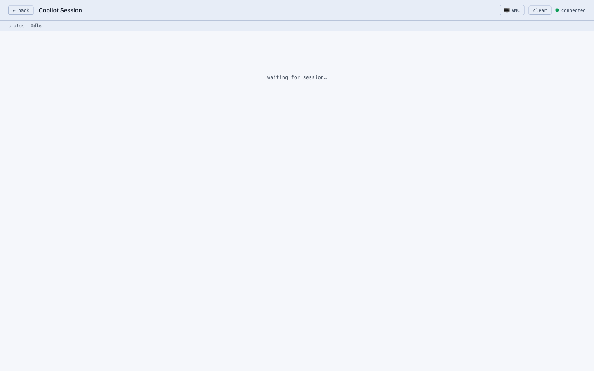

# Browser agent

Your delegate can browse the web on your behalf — not just search, but actually open a browser, navigate to sites, fill in forms, log in with your credentials, and complete tasks that normally require a human clicking around.

**Examples of things you can ask:**
- "Book me a table on OpenTable for Saturday at 7pm"
- "Check my electricity account and tell me the current balance"
- "Find the noise complaint form on the council website and fill it in"

## How to turn it on

Go to **Settings** and enable the browser agent. You'll need two things:

1. **Browser agent toggle** — turns the feature on (`BROWSER_ENABLED=true`)
2. **GitHub Personal Access Token** — the browser agent uses GitHub Copilot as its "brain" to understand your instructions and decide what to click. A GitHub token is how it accesses that capability.

Once enabled, a browser session will be available in the background ready to take on tasks.

## Using the browser agent

Open **[/copilot.html](/copilot.html)** and type your task in plain English, just like chatting normally.

## Watching it work

The delegate opens a real browser in the background. You can watch exactly what it's doing — every click, every page load — via the **live browser view at [/vnc.html](/vnc.html)**. If something goes wrong or you want to step in, you can take over from there.

## A note on security

The browser agent can access any website the browser can reach, including sites where you're logged in. Only give it tasks you'd be comfortable handing to a trusted assistant. Avoid asking it to handle anything sensitive unless you're confident in what it's being asked to do.

---

## Technical details

- The browser agent is powered by **GitHub Copilot CLI**, which acts as the reasoning layer that turns natural-language instructions into browser actions.
- The browser itself is a **Chromium** instance controlled by **Playwright**, running with a persistent profile stored under `runtime-data/browser-profile/`.
- Copilot CLI runs inside `runtime-data/copilot-workdir/`. A dispatch layer in `src/copilot-agent/` passes tasks between the model and the CLI.
- The live view at `/vnc.html` streams the browser desktop over VNC; the password is set by `VNC_PASSWORD` in your environment.
- For self-hosted deployments, the browser agent runs best inside the `Dockerfile.browser` / `docker-compose.browser.yml` Docker setup, which bundles Chromium and a VNC server.
- Run browser agent tests with `npm run test:copilot`.
