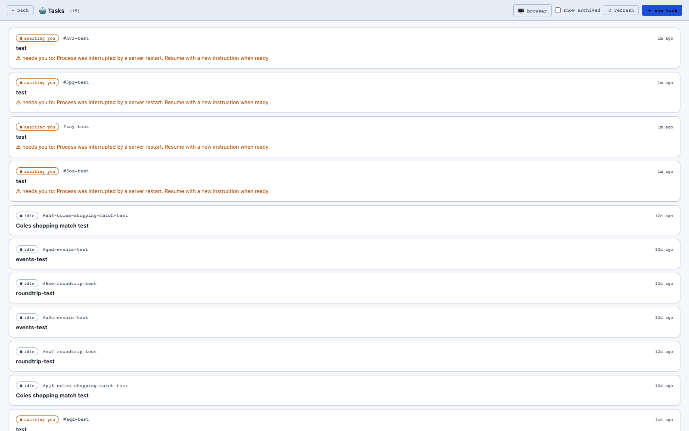
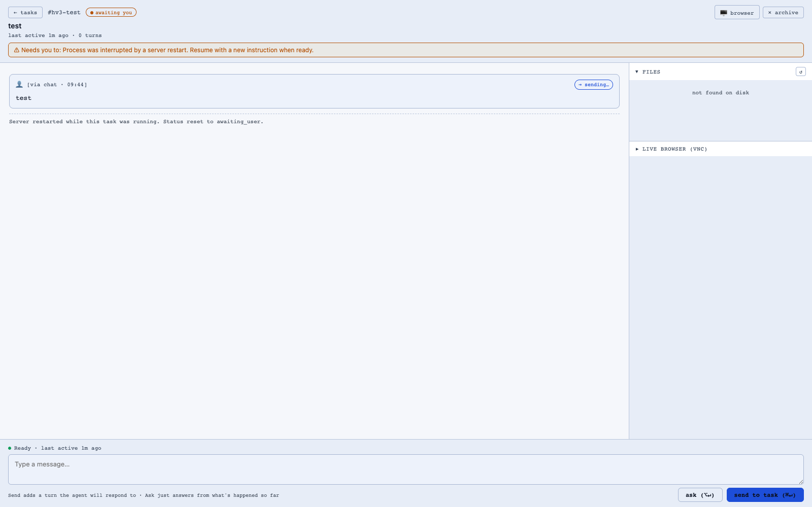

# Copilot Tasks

Copilot Tasks is the async delegation layer for browser-heavy work. Instead of blocking the main conversation while a long browser run executes, tasks are persisted, stream progress, and can be resumed later.

## What makes it different

- Durable lifecycle: tasks survive server restarts and are reconciled on startup.
- Resumable workflow: continue a task with follow-up instructions from the task detail view.
- Live event stream: task logs/events stream into the UI using SSE.
- Workspace visibility: browse files produced by the task directly from its workdir.
- Safe handoff: ask a question about task state without creating a new Copilot turn.

## Typical flow

1. Open **Tasks** in the app.
2. Create a task with a prompt and optional title.
3. Watch status change through `running`, `awaiting_user`, `completed`, or `failed`.
4. Open task detail, then either continue the task, ask contextual questions, or archive it.

## Browser live view

The tasks UI can show live browser state (when browser infra is available). If VNC is not reachable, the UI now shows a clear explanation instead of failing silently.

## Technical details

- API surface lives in `src/server/routes/copilotTasks.ts`.
- Runtime orchestration lives in `src/copilot/taskRunner.ts` and persistence in `src/copilot/tasks.ts`.
- Task workdirs are created under `runtime-data/copilot-workdir/tasks/<task-id>/`.
- Pretty task URLs are supported: `/tasks/<id>` routes to `client/task.html`.

Key endpoints:

| Method | Path | Purpose |
|---|---|---|
| GET | `/api/copilot/tasks` | List tasks |
| POST | `/api/copilot/tasks` | Create task |
| GET | `/api/copilot/tasks/:id` | Fetch one task |
| POST | `/api/copilot/tasks/:id/continue` | Enqueue next user turn |
| POST | `/api/copilot/tasks/:id/cancel` | Cancel active turn |
| POST | `/api/copilot/tasks/:id/archive` | Archive/unarchive |
| GET | `/api/copilot/tasks/:id/events` | Poll events |
| GET | `/api/copilot/tasks/:id/events/stream` | Stream events (SSE) |
| GET | `/api/copilot/tasks/:id/files` | List workdir entries |
| GET | `/api/copilot/tasks/:id/file` | Download/view a file |
| POST | `/api/copilot/tasks/:id/ask` | Ask context question about task state |
