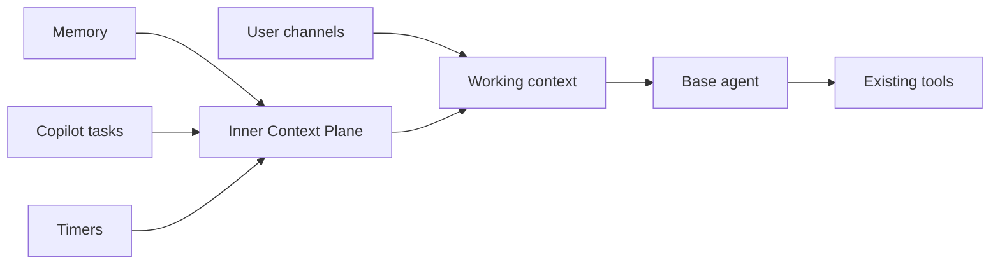

# Inner Context Plane

The Inner Context Plane gives the delegate first-class awareness of activity inside its own subsystems. Memory recall, memory consolidation, completed Copilot tasks, timers, and future background processors all enter through the same plane as **inner signals**: context from the delegate's components, not messages from the user.

This creates one coherent way for the delegate to notice that it remembered something, learned something, reached a scheduled moment, or received the result of delegated work. The single base agent remains responsible for deciding what the signal means and whether to act.

## How it works

Delegate 1 keeps user communication and background activity distinct:

- **Outer context** comes directly from the user through text, voice, phone, SMS, or email.
- **Inner context** comes from memory and other agent subprocessors.
- **Working context** combines the relevant parts of both with standing memories, prompt instructions, and time.

An inner signal is never represented as a user statement. Subprocessors report what happened; the single base agent interprets the signal and uses its existing tools when action is useful.

## Attention

Not every background event starts a model run. Each signal declares how it enters awareness:

| Mode | Behaviour |
|---|---|
| `ambient` | Retained and included only when relevant to later work |
| `next-turn` | Included the next time the base agent runs |
| `wake` | Starts an autonomous turn when the base agent is idle |
| `interrupt` | Interrupts current work; reserved for exceptional, urgent conditions |

The Attention Broker may batch related signals so several subprocess completions produce one coherent awakening rather than competing model calls.

## Signal lifecycle

1. A subprocessor publishes an inner signal.
2. The signal is written to a durable journal.
3. The Attention Broker applies timing, priority, deduplication, and batching rules.
4. The Context Composer uses the activation, including selected signals and the current time, as a cue for passive memory retrieval.
5. The selected signals and recalled memories enter working context separately from user messages.
6. The base agent applies its prompt, then acts with existing tools or dismisses the signal.
7. The outcome is recorded and failed delivery remains retryable.

Only one base-agent activation may run at a time. A user turn takes precedence over background awareness, except for explicitly permitted interrupt signals.

## Activation and recall

Every base-agent activation follows the same context-composition path, whether it begins with a user message or an inner signal. A timer wake therefore carries its identity, scheduled time, recurrence, and purpose into passive memory retrieval before the model runs. Memories such as "when the periodic review wakes, check outstanding commitments" can surface naturally from that cue and guide the agent through its existing tools.

Timers do not encode those behaviours or map schedules to actions. They only publish that a scheduled moment is due. The shared retrieval and prompt path supplies learned intent, so the same mechanism also works for task completions, consolidation events, and future signal sources.

## Signal sources

| Source | Typical signals |
|---|---|
| Memory | Consolidation, conflict, and override outcomes |
| Copilot Tasks | Completion, input required, and failure |
| Timers | Scheduled work becoming due |
| External processors | Status or results delivered through trusted HTTP or MCP adapters |

The durable journal gives the delegate a truthful history of its background activity. For example, it can describe recent consolidation runs from recorded memory signals rather than reconstructing them from conversation transcripts.

Brand-new memory inserts do not wake the agent. Consolidated, conflicting, and overridden memories do, because they represent a meaningful relationship with existing knowledge. This avoids a feedback loop where every ordinary extraction starts another autonomous activation.

## Logs and UI

- Server logs use structured `[inner-context]` lines for publication, deduplication, batch activation, completion, and failure. Each publication includes the stable signal ID, kind, source, and awareness mode.
- The conversation timeline is the primary operator view. It shows expandable internal-activity entries in sequence with memory recall, tool calls, tool results, and the assistant's response.
- Activation entries retain the full claimed batch: stable IDs, kinds, sources, awareness modes, priorities, attempts, creation times, payloads, and the composed inner-context envelope.
- Signals consumed by a genuine user turn appear as `Inner context attached to user turn`; autonomous work appears as started followed by completed or failed.
- Replayed history rebuilds the same sequence from durable conversation events, including recalled memory content and activation duration or error. Inner context is never rendered as a user message.

The UI also uses the **Inner Plane** label for internal context operations that are observable but are not themselves wake signals:

| Event | Meaning |
|---|---|
| Memory retrieval | Pending, miss, or recalled memories injected into working context |
| `context.usage` | Responses or Realtime token usage recorded for the turn |
| `context.compacted` | Official Responses compaction completed |
| `context.capsule` | Continuity capsule refresh started, completed, or failed |

This is a presentation category, not a claim that token usage or compaction passed through the Attention Broker. Usage, compaction, and completed capsule events replay from durable conversation events; capsule `started` and `failed` notifications are live-only. All remain distinct from user messages.

## Prompt and memory

The plane supplies awareness, not behaviour. Code handles persistence, timing, ordering, concurrency, and trust boundaries. The prompt and standing memories determine whether a signal deserves action, which existing tool to use, and whether the user should be contacted.

This allows instructions such as "email me when consolidation teaches you something new" to be learned as memory instead of implemented as a dedicated tool or hardcoded workflow.

## Technical details

- Signals carry a stable ID, namespaced kind, source, timestamps, priority, awareness mode, structured data, and processing state.
- Signals are stored separately from user conversation transcripts and never enter the model as user-role input.
- Processing is serialized so background activity cannot replace an active user request.
- Repeated callbacks are deduplicated, failures are bounded and retryable, and context composition is size-limited.
- Untrusted external content is labelled and delimited; it cannot elevate itself into system instructions.
- ThoughtFlow records the signals selected for a run, the agent's decision, tool actions, and final disposition.