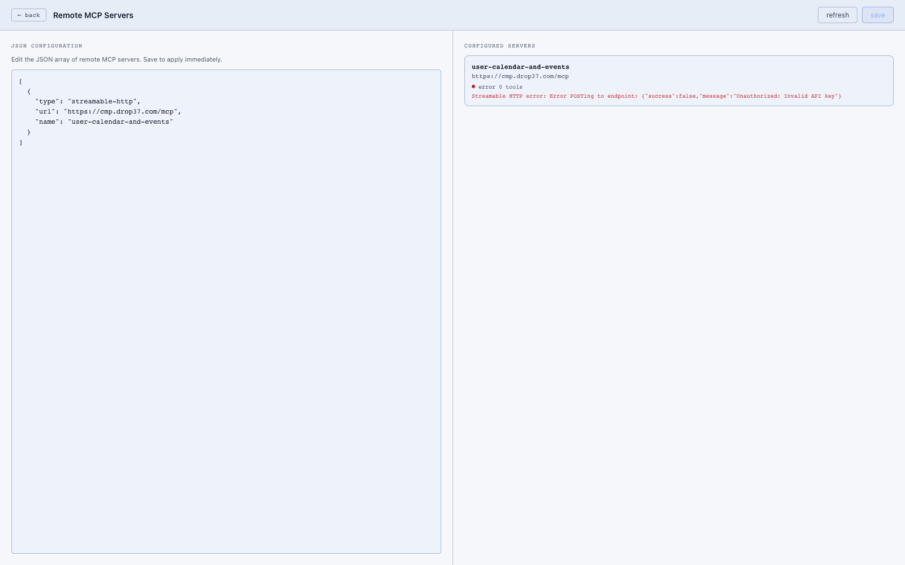

# Connected services

Your delegate can connect to external services — calendars, project management tools, databases, APIs — and act on them directly from a natural conversation. Once a service is connected, you can say things like *"schedule a meeting with John next Tuesday at 3pm"* and it just happens.

This works through a standard called the Model Context Protocol (MCP). Think of it like installing apps: each connected service tells your delegate what it can do, and your delegate figures out how to use it automatically.



## Connecting a service

1. Go to **Settings → MCP Servers**.
2. Click **Add server**.
3. Paste the URL provided by your service (your administrator or the service's documentation will have this).
4. Click **Save**.

That's it. Your delegate discovers what the service can do and makes it available immediately — no restart needed.

## What you can do with connected services

Once a service is connected, you interact with it through normal conversation. Examples:

- **Calendar**: *"What's on my calendar tomorrow?"* or *"Book a 30-minute call with Sarah on Friday afternoon."*
- **Project management**: *"Create a task to follow up with the client by end of week."*
- **Custom data**: Whatever your service exposes becomes something your delegate can read, create, or update on your behalf.

## Controlling access

Not every connected service needs to be available to every part of your delegate. Agent policies let you decide which services each agent can use — for example, you might give the everyday assistant calendar access but keep sensitive database tools restricted to a more controlled workflow.

See [Agents & policies](../agents-and-policies/) for details.

---

## Technical details

Services are registered in `runtime-data/mcp-servers.json`:

```json
{
  "servers": [
    {
      "id": "user-calendar-and-events",
      "url": "https://cmp.drop37.com/mcp",
      "transport": "http"
    }
  ]
}
```

You can also read and write this config via the API:

| Method | Path |
|---|---|
| GET | `/api/mcp/config` |
| POST | `/api/mcp/config` |

### Tool discovery

At startup the MCP adapter (`src/mcp/`) connects to each configured server, lists its tools, and registers them through the canonical tool registry under the `mcp` provider:

```
[mcpClient] Connecting to MCP server user-calendar-and-events at https://...
[mcpClient] Discovered 5 tools on user-calendar-and-events
[mcpAdapter] MCP discovery complete. 5 tool(s) registered.
```

### Access control

Agent policies govern which agents can call which MCP tools. MCP tools are tagged so you can allow them in bulk by tag. See `runtime-data/agent-policies.json`.
