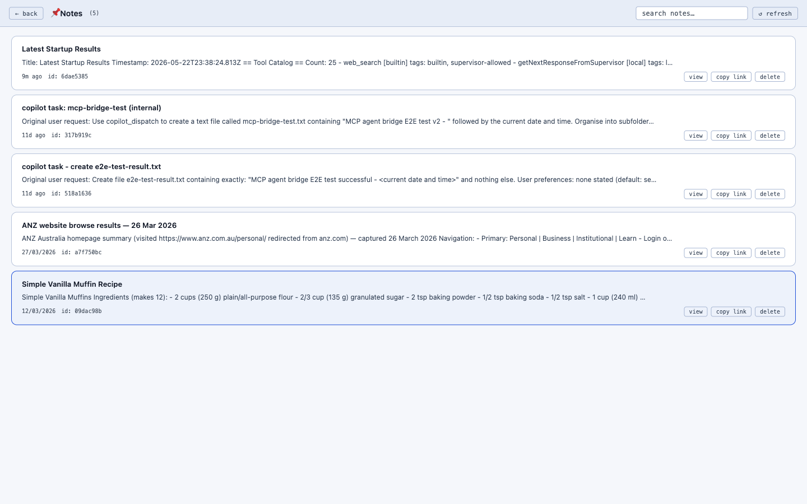

# Notes

A simple persistent note store that doubles as a tool the agent can call.

## Storage

Notes are JSON documents in `runtime-data/notes.json` (or `$RUNTIME_DATA_DIR/notes.json`). The store is implemented in `src/noteStore.ts`.

## UI

- `/notes-list.html` lists all notes.
- `/notes/:id` (HTML page) renders a single note.

## API

| Method | Path | Purpose |
|---|---|---|
| GET | `/api/notes` | List notes |
| GET | `/api/notes/:id` | Get one |
| POST | `/api/notes` | Create |
| PUT | `/api/notes/:id` | Update |
| DELETE | `/api/notes/:id` | Delete |

## Agent integration

The local tool provider exposes note tools so the agent can read and write notes directly during a conversation. Combined with [memory](../memory/), this gives the agent two complementary stores: short-form *facts* (memory) and long-form *documents* (notes).
