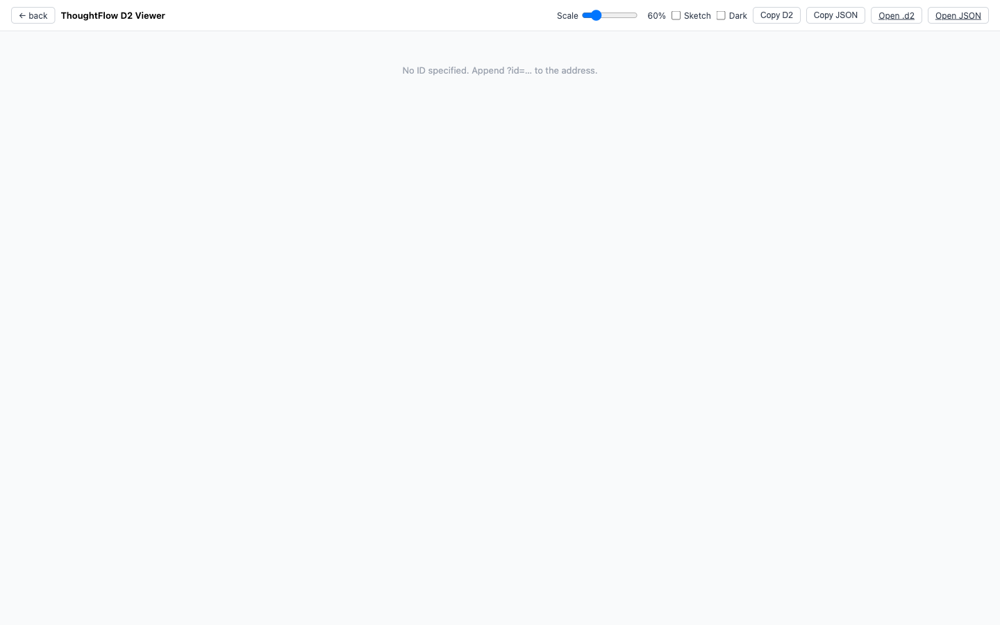

# Thoughtflow

Thoughtflow lets you see inside your delegate's thinking. After any conversation turn, you can open a visual map showing exactly how your delegate handled your request — no guesswork, no black box.

## What it shows

Each diagram traces one complete response from start to finish:

- **What you sent** — the message your delegate received
- **Which AI model was called** — and when
- **Which tools were used** — for example, a web search or a calendar lookup
- **What those tools returned** — the actual data the delegate worked with
- **How it reached its answer** — including any time it escalated to a more powerful reasoning mode

## Why it's useful

When your delegate does something unexpected — or surprisingly good — Thoughtflow lets you understand exactly why. You can see which tool surfaced a piece of information, whether a search returned useful results, or why a response took the path it did.

## How to use it

1. Have a conversation with your delegate as normal.
2. Open **`/thoughtflow/viewer`** in your browser.
3. You'll see a list of recent runs, newest first.
4. Click any entry to open its diagram.

Each diagram is interactive — you can zoom and pan to explore the full flow.

## Technical details

- Artifacts are written to `runtime-data/thoughtflow/` as `.d2` source files plus rendered output.
- Diagrams are generated in [D2](https://d2lang.com/) format.

**Viewer endpoints:**

| Path | Purpose |
|---|---|
| `/thoughtflow/viewer` | Index of all runs |
| `/thoughtflow/viewer/:id` | View one run |
| `/thoughtflow/raw/:id.d2` | Raw D2 source |
| `/thoughtflow/:id.:ext` | Rendered artifact (e.g. `.svg`, `.png`) |

**Reference example diagrams** (included in the repo):

- `detail-run1-llm.d2` — a basic LLM call
- `detail-run2-weathercall.d2` — a tool call sequence
- `detail-run3-memwrite.d2` — a memory write

**Debugging:** set `LEDGER_DEBUG=1` for extra structured logging from the event ledger that backs Thoughtflow.

See also: [Operations → Logging](../../operations/logging/).
