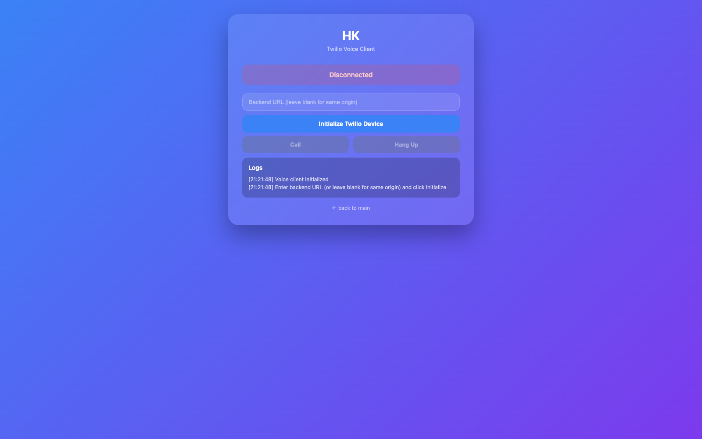
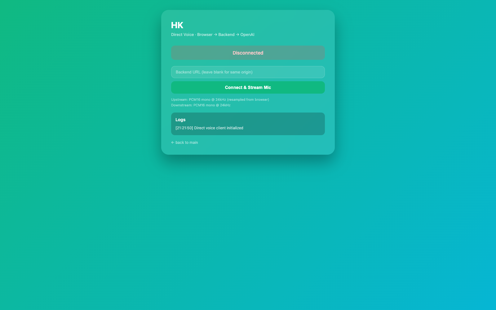

# Voice (browser)

{: .note }
> **Beta feature.** Browser voice works well but is a secondary option — most people will use the [phone integration](../phone/) for voice conversations. This page is here for those who want to try it.

Talk to your delegate out loud — right in your browser. No phone needed, no extra apps to install. Click the microphone button and have a real spoken conversation in real time.

## How to use it

1. Click **Voice (browser)** in the sidebar menu.
2. Click the **microphone button** to start a session.
3. Start talking. Your delegate will listen and respond with speech.
4. Click the button again to end the session.

That's it. The conversation works just like talking to another person.

## Interrupting mid-sentence (barge-in)

You don't have to wait for your delegate to finish speaking before you talk. If you want to jump in, just start talking — your delegate will stop what it's saying and listen to you immediately. This makes the conversation feel natural rather than taking rigid turns.

## Voice presets

You can customise the voice your delegate speaks with — things like which voice character is used, speaking speed, and the underlying model. These are managed as **voice presets** in your settings.

## Browser voice vs. phone

| | Browser voice | Phone |
|---|---|---|
| **Setup** | None — works in any browser tab | Requires a phone number to be configured |
| **Cost** | Free | Depends on your phone plan / Twilio usage |
| **Best for** | Quick conversations at your desk | Talking while away from your computer |

Both options give you the same delegate and the same conversation — it's just a question of which device is more convenient at the time.

## Testing / simple version

`/voice-direct.html` is a stripped-down version of the voice interface that's useful for quickly checking that the microphone and audio connection are working.

---

## Technical details

- Audio path: browser mic → PCM16 24 kHz → `/browser-call` WebSocket → OpenAI Realtime API → PCM16 frames back → Web Audio API playback.
- Barge-in: interruption is handled natively by Realtime API turn detection (`interrupt_response: true`). The server flushes downstream buffers and suppresses stale deltas during interruption handling. Implementation: `src/session/browserCall.ts`, shared pipeline in `src/voice/`.
- Voice presets stored in `runtime-data/voice-presets/`; defaults from `REALTIME_VOICE`, `DELEGATE_VOICE_SPEED`, and base agent voice config.
- Voice pipeline tests: `npm run test:voice` (`src/voice/voicePipeline.test.ts`). End-to-end flows covered by `npm run test:e2e`.
- See also: [Phone (Twilio)](../phone/) — same Realtime API plumbing, different audio codec (G.711 µ-law).
