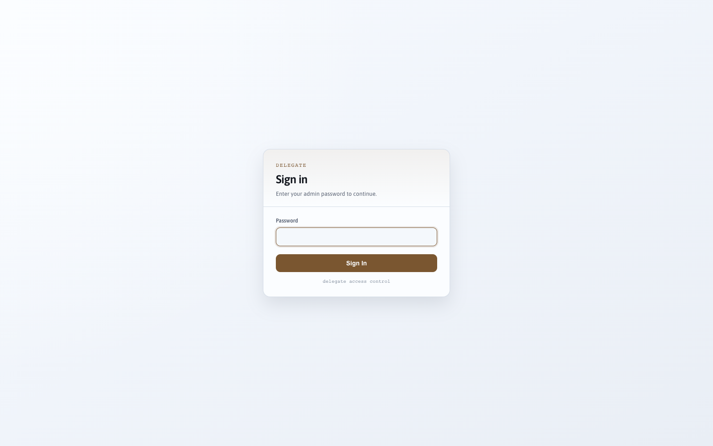
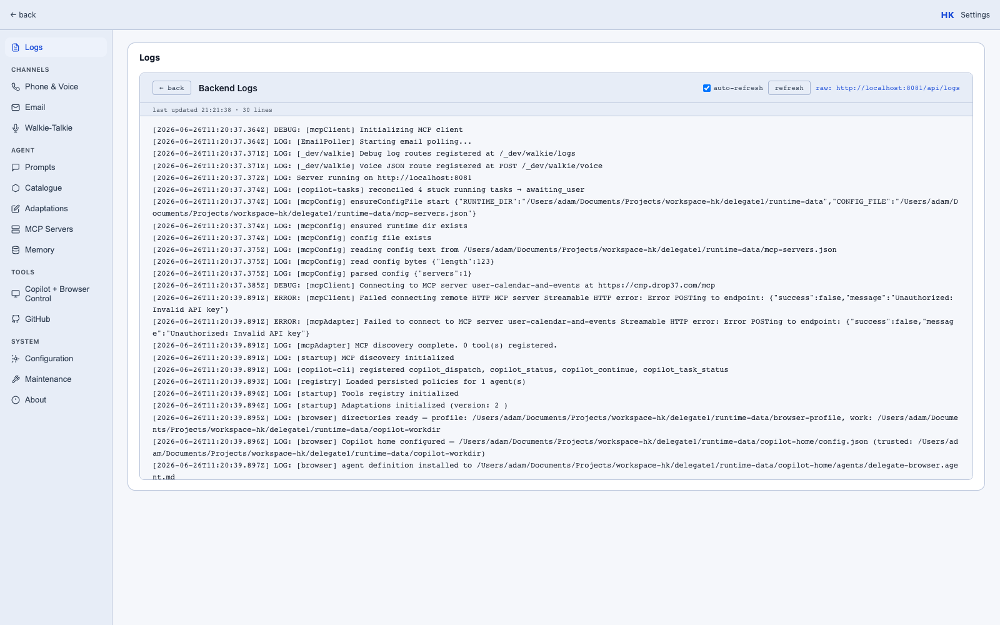

# Configuration

Delegate 1 keeps two layers of configuration:

1. **`.env`** — a small handful of bootstrap variables read directly from the process environment.
2. **In-app config store** (`runtime-data/config.*`) — most settings (API keys, Twilio creds, email creds, feature toggles) are stored encrypted via the in-app `configService` and edited through the **Settings** UI or the install flow.

The `configService` reads from the in-app store **first** and falls back to `process.env` if the key isn't set. That means you can put any of the keys below in `.env` for dev, or set them via the UI later.

## 1. Create your `.env`

```bash
cp .env.example .env
```

The starter `.env.example` is intentionally tiny:

```bash
# Notification endpoint for startup script (optional)
CALL_MY_PHONE_ENDPOINT=https://your-notify-endpoint.example.com/notify
CALL_MY_PHONE_SECRET=your-secret-api-key-here

# Browser agent (Copilot CLI + Playwright) — optional
# Enable and configure this in Settings -> Browser
# (including the Copilot Sign-In Token)
# BROWSER_ENABLED=true
# VNC_PASSWORD=delegate

FRONTEND_URL=http://localhost:8081
STARTUP_NOTIFY_MESSAGE="Servers started successfully"
```

Add at minimum your OpenAI key:

```bash
OPENAI_API_KEY=sk-...
```

You can also set the admin password here to skip the install flow:

```bash
ADMIN_PASSWORD=changeme
```

## 2. First-launch install flow

The first time you start the server, the **Install** page at `/install` runs through a guided setup that writes most config into the encrypted in-app store:



The install flow sets the admin password (used for the login page above) and lets you paste in API keys without putting them in `.env`.

## 3. Edit settings any time

Once installed and logged in, **Settings** (`/settings.html`) lets you edit every config key:



See the full table in **[Reference → Env Vars](../../reference/env-vars/)**.

### GitHub token setup (explicit steps)

Use the Settings pages for GitHub tokens:

1. For browser/Copilot tasks: **Settings -> Browser -> Copilot Sign-In Token**.
2. For GitHub API tools (repo listing/issues): **Settings -> GitHub -> GitHub Personal Access Token**.

For **Settings -> Browser -> Copilot Sign-In Token**, use this simple flow:

1. Create a **fine-grained** PAT in GitHub.
2. Set **Resource owner** to your personal account.
3. Under **Permissions -> Account**, add **Copilot Requests**.
4. Generate the token, copy it, paste it into the Browser field, and save.

For **Settings -> GitHub**, create or use a token with the repo/issue permissions you need for those tools.

How to create a GitHub PAT:

1. Sign in to GitHub.
2. Click profile photo (top right) -> **Settings**.
3. Open **Developer settings**.
4. Open **Personal access tokens**.
5. Choose **Fine-grained tokens** -> **Generate new token** (recommended).
6. Set token name, expiration, and resource owner.
7. Choose repository access (all or selected repos).
8. Add required permissions for your use case (for issue filing, include **Issues: Read and write**).
9. Click **Generate token** and copy it immediately.
10. Paste into the relevant Delegate Settings field above and click **Save All Settings**.

If fine-grained tokens are blocked by org policy, use **Tokens (classic)** -> **Generate new token (classic)** as a fallback.

## Bootstrap vs in-app config

| Setting | Where to set | Reason |
|---|---|---|
| `PORT` | `.env` only | Read once on startup |
| `RUNTIME_DATA_DIR` | `.env` only | Determines where the in-app store lives |
| `ADMIN_PASSWORD` | `.env` *or* install flow | Either works |
| `OPENAI_API_KEY`, `TWILIO_*`, `EMAIL_*`, `DEEPGRAM_API_KEY`, `PUBLIC_URL`, `BROWSER_ENABLED`, etc. | Settings UI *or* `.env` | UI is preferred for prod (encrypted at rest). For GitHub tokens, use the Settings pages (Browser and GitHub). |

Next: [First run](../first-run/).
