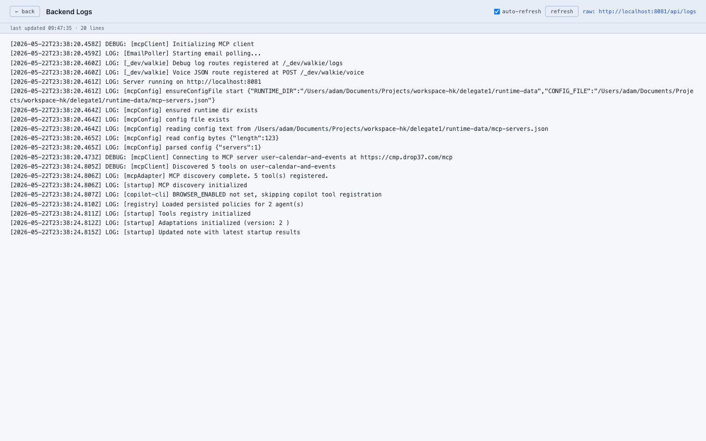

# Logging

The backend writes to stdout and to an in-process ring buffer (`src/logBuffer.ts`) that powers the **Logs** page.

## UI

`/logs.html` streams the buffer live. Useful for debugging:

- Tool registry init (`[startup] Tools registry initialized`)
- MCP connections (`[mcpClient] Connecting to ...`)
- Agent turns and escalations
- Voice/phone barge-in events

## API

| Method | Path | Purpose |
|---|---|---|
| GET | `/api/logs` | Read the buffer |

## Debug flags

| Env var | Effect |
|---|---|
| `LEDGER_DEBUG=1` | Verbose event-ledger logging (powers [thoughtflow](../../features/thoughtflow/)) |
| `ITEMS_DEBUG=1` | Verbose item-level tracing in the agent loop |

## Dev "walkie" routes

For lower-level debugging there are `_dev/walkie/*` routes (`POST/GET /_dev/walkie/logs`, `GET /_dev/walkie/logs/stream`, `POST /_dev/walkie/voice`) — these are not for general use but are handy when iterating on voice or log handling.
