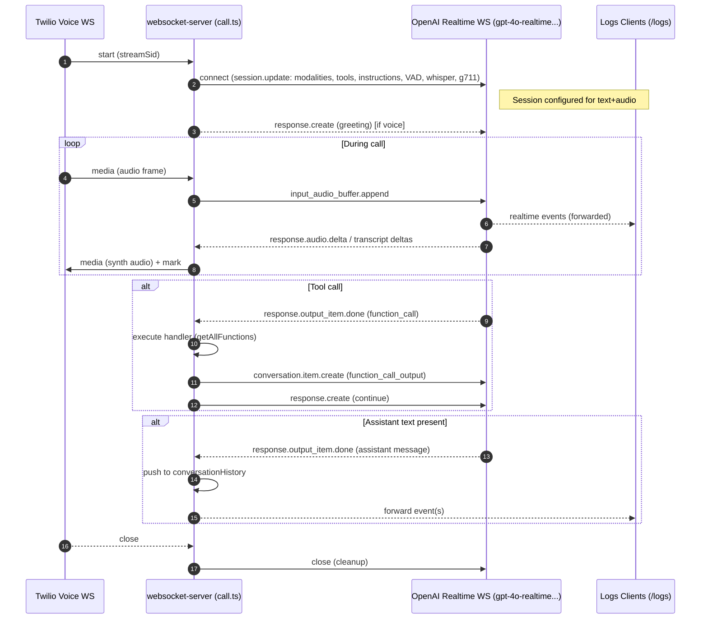
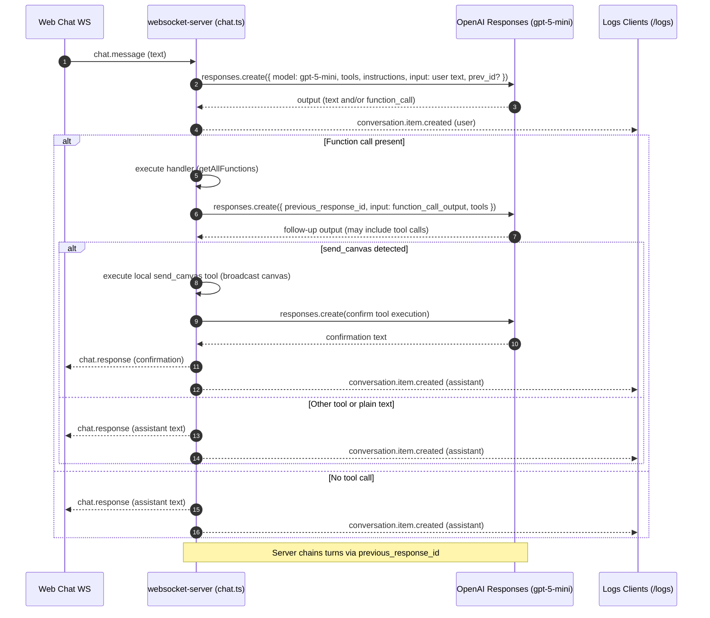

# Model Calling Flows: Voice Call vs Text Chat

This document explains how the websocket-server calls OpenAI models for the two session paths and why the models differ.

- __Files__: `websocket-server/src/session/call.ts`, `websocket-server/src/session/chat.ts`
- __Channels__: Voice Calls (Twilio media WS) vs Text Chat (web chat WS)

## Summary of Differences

- __Transport__
  - Voice: OpenAI Realtime WebSocket API
  - Text: OpenAI Responses REST API

- __Model__
  - Voice: `gpt-4o-realtime-preview-2024-12-17`
  - Text: `gpt-5-mini`

- __Modalities__
  - Voice: `text` + `audio` (bi-directional)
  - Text: `text` only

- __Turn detection / ASR__
  - Voice: `turn_detection: server_vad`, transcription via `whisper-1`, audio format `g711_ulaw`
  - Text: N/A (user text message only)

- __Tool invocation__
  - Voice: Tools surfaced as realtime events (e.g., `response.output_item.done` with `function_call`), server executes handler and replies via `conversation.item.create` + `response.create`.
  - Text: Tools returned in Responses output as `function_call`, server executes handler, then sends follow-up `responses.create` with `function_call_output` (and optionally a confirmation turn).

- __Thread/continuation__
  - Voice: Persistent WS session configured via `session.update`; conversation state is internal to the Realtime session.
  - Text: Uses `previous_response_id` to chain turns across `responses.create` calls.

- __Event forwarding / observability__
  - Voice: Forwards all Realtime events to logs clients (`/logs`). Streams synthesized audio back to Twilio.
  - Text: Broadcasts synthetic conversation items to logs and sends assistant/plaintext to chat clients.

- __Conversation history__
  - Both push messages into `session.conversationHistory`, but Voice only pushes assistant text when present in an item; Text always persists the assistant output.

## Voice Call Flow (`src/session/call.ts`)

- __Entry__: Twilio connects WebSocket and sends media/events (`start`, `media`, `close`).
- __Model__: Realtime WS to `gpt-4o-realtime-preview-2024-12-17`.
- __Session config__: modalities `text,audio`, VAD, voice `ballad`, `speed: 1.3`, `input_audio_transcription: whisper-1`, audio formats `g711_ulaw`, tools from `getAllFunctions()`, instructions from `getDefaultAgent()`.
- __Audio in/out__: Append inbound frames to `input_audio_buffer`; stream out synthesized audio via Twilio `media` events; handle truncation on barge-in.
- __Tools__: When `response.output_item.done` contains `function_call`, execute and send `function_call_output` via `conversation.item.create`, then `response.create` to continue.

## Text Chat Flow (`src/session/chat.ts`)

- __Entry__: Web chat sends `chat.message` over WS.
- __Model__: OpenAI Responses API (`responses.create`) with `gpt-5-mini`.
- __Threading__: Uses `previous_response_id` to maintain context across turns.
- __Tools__: If model returns a `function_call`, server executes handler and sends a follow-up `responses.create` with `function_call_output`. Special handling for `send_canvas` to broadcast rich content and then confirm.

## Rationale for Model Choices

- __Realtime voice (`gpt-4o-realtime-preview-2024-12-17`)__
  - Designed for low-latency bi-directional audio + text.
  - Built-in VAD, live ASR (`whisper-1`), and audio synthesis suitable for Twilio streaming (`g711_ulaw`).
  - Realtime event stream enables immediate barge-in, truncation, and tool handling.

- __Text chat (`gpt-5-mini`)__
  - Cost-effective, fast text model for chat UX.
  - Pairs well with the Responses API’s tool-calling and `previous_response_id` threading.
  - Supervisor-friendly: easy to run a tool call, feed `function_call_output`, then elicit a concise final answer or trigger UI-specific tools like `send_canvas`.

## Key Code Touchpoints

- __Voice__: `establishRealtimeModelConnection()`, `processRealtimeModelEvent()`, `handleFunctionCall()` in `src/session/call.ts`.
- __Text__: `handleTextChatMessage()` in `src/session/chat.ts` with the two-stage tool flow and `previous_response_id` chaining.

