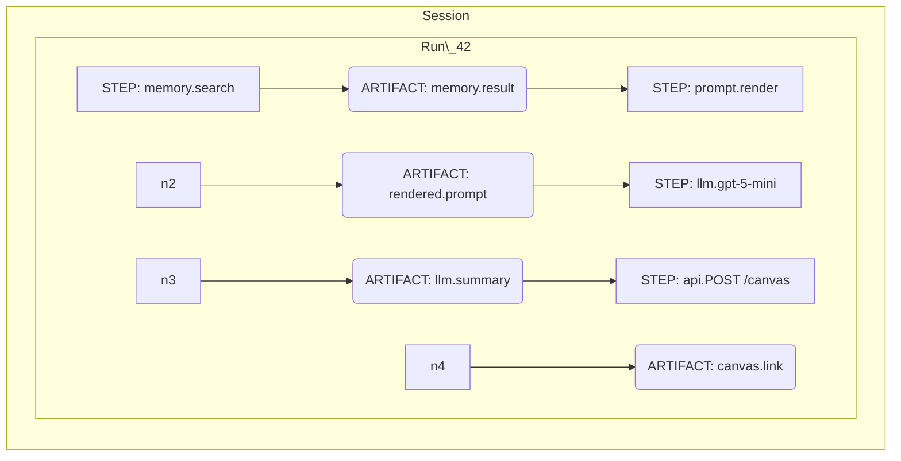

# Seeing the Graph: A Conceptual Model for Provenance in Agentic AI (with examples)

We don’t need another chat UI. We need a way to **see how work happens** inside it. That requires a clear conceptual model—independent of frameworks and implementation details—that turns messy transcripts into a structured, inspectable graph of cause and effect.

This post lays out that model and shows concrete examples of the recorded data and views.

---

## 1) The Core Idea

Every agent interaction is a **graph**: operations that happen over time (steps) and the data they create or consume (artifacts), connected by explicit relationships (edges). Chat is how we *experience* the system; the **provenance graph** is how we *understand* it.

---

## 2) Entities and Relationships

* **Session**: container for a conversation (voice/chat). Contains 0..N runs.
* **Run**: discrete task within a session. Contains turns, steps, artifacts.
* **Step (STEP)**: operation with timing and status. Categories: io, llm, api, tool, cache, db, memory, compute, transform, control.
* **Artifact (ARTIFACT)**: data produced/consumed (prompt text, API JSON, memory results, final message).
* **Edge**: uses, produces, reads, writes, depends\_on, follows, triggers, associates\_with (with optional confidence 0..1).

---

## 3) A Minimal Recorded Run (JSON)

This is a compact, LLM‑ingestible **Run Bundle**. Only previews (≤200 chars) are included for privacy.

{
"version": "pg-1.0",
"session\_id": "sess\_abc",
"run\_id": "run\_42",
"started\_at": "2025-09-01T04:52:18Z",
"ended\_at": "2025-09-01T04:53:12Z",
"status": "completed",
"nodes": \[
{"id":"n1","type":"STEP","category":"memory","name":"memory.search","ts\_start":"...","ts\_end":"...","status":"ok","metrics":{"latency\_ms":12}},
{"id":"a1","type":"ARTIFACT","media\_type":"application/json","preview":"{"results":\[...]}"},
{"id":"n2","type":"STEP","category":"transform","name":"prompt.render","ts\_start":"...","ts\_end":"...","status":"ok"},
{"id":"a2","type":"ARTIFACT","media\_type":"text/plain","preview":"How is a quota calculated when..."},
{"id":"n3","type":"STEP","category":"llm","name":"gpt-5-mini","ts\_start":"...","ts\_end":"...","status":"ok","metrics":{"latency\_ms":31480,"tokens\_in":310,"tokens\_out":180}},
{"id":"a3","type":"ARTIFACT","media\_type":"text/markdown","preview":"Summary answer..."},
{"id":"n4","type":"STEP","category":"api","name":"POST /canvas","ts\_start":"...","ts\_end":"...","status":"ok","metrics":{"latency\_ms":401}},
{"id":"a4","type":"ARTIFACT","media\_type":"application/json","preview":"{"url":"https\://..."}"}
],
"edges": \[
{"from":"n1","to":"a1","relation":"produces"},
{"from":"a1","to":"n2","relation":"uses"},
{"from":"n2","to":"a2","relation":"produces"},
{"from":"a2","to":"n3","relation":"uses"},
{"from":"n3","to":"a3","relation":"produces"},
{"from":"a3","to":"n4","relation":"uses"},
{"from":"n4","to":"a4","relation":"produces"}
],
"main\_output": {"node\_id":"n4","artifact\_id":"a4"}
}

---

## 4) The Same Run as a DOT Graph (export)

digraph Run {
rankdir=LR;
node \[shape=box];
"n1" \[label="memory memory.search\nok 12ms"];
"a1" \[label="application/json\n{"results":\[...]}" ];
"n2" \[label="transform prompt.render\nok"];
"a2" \[label="text/plain\nHow is a quota calc…" ];
"n3" \[label="llm gpt-5-mini\nok 31480ms"];
"a3" \[label="text/markdown\nSummary answer…" ];
"n4" \[label="api POST /canvas\nok 401ms"];
"a4" \[label="application/json\n{"url":"https\://…"}" ];
"n1" -> "a1" \[label="produces"];
"a1" -> "n2" \[label="uses"];
"n2" -> "a2" \[label="produces"];
"a2" -> "n3" \[label="uses"];
"n3" -> "a3" \[label="produces"];
"a3" -> "n4" \[label="uses"];
"n4" -> "a4" \[label="produces"];
}

---

## 5) Mermaid View (conceptual flow)

Note: Mermaid simplifies the layout; it’s not a strict 1:1 with the provenance graph.

---

## 6) Reading and Using the Model

Start at the run’s main output (here, `canvas.link`) and walk backward along edges:

* Which step produced it? `api.POST /canvas`.
* Which artifact fed that step? `llm.summary`.
* Which step produced that artifact? `llm.gpt-5-mini` (with tokens and latency).
* Continue back through prompt rendering and memory to reconstruct causality.

Because the model is generic and minimal, it works for other shapes: tool‑heavy flows, cache‑hit fast paths, or multi‑run chains (use the `follows` relation to connect runs).

---

## 7) Why This View Scales

* **Abstraction**: category + name + small edge vocabulary covers most agent systems.
* **Compression**: previews and hashes keep artifacts tiny; full bodies remain external.
* **Honesty about causality**: `associates_with` lets you record useful correlations without over‑claiming.

With a consistent recorded shape, both humans and models can analyze workflows without re‑implementing the UI.
